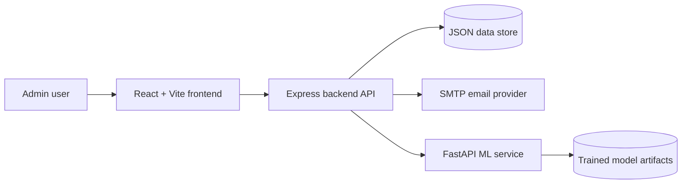

# Telecom Churn Prediction Platform

An end-to-end customer churn platform with a React dashboard, an Express API, and a FastAPI machine-learning service. The app supports authenticated admin access, customer analytics, churn predictions, notification alerts, SMTP-based password resets, and Docker Compose deployment.

## Architecture



## Services

| Service | Path | Default URL | Purpose |
| --- | --- | --- | --- |
| Frontend | `frontend` | `http://localhost:5173` locally, `http://localhost` in Docker | Dashboard and login UI |
| Backend | `backend` | `http://localhost:3000/api` | Auth, persistence, notifications, API gateway |
| ML service | `ml-service` | `http://localhost:8000` | Churn prediction, model metrics, analytics |

## Prerequisites

- Node.js 20 LTS or newer
- Python 3.11
- npm
- Docker and Docker Compose, if running containers
- SMTP credentials for password reset and alert emails

For Gmail SMTP, use a Gmail app password. A normal Gmail account password will be rejected.

## Environment Setup

1. Create local environment files:

```bash
cp backend/.env.example backend/.env
cp frontend/.env.example frontend/.env
cp ml-service/.env.example ml-service/.env
```

2. Edit `backend/.env`:

```env
ADMIN_EMAIL=admin@example.com
ADMIN_PASSWORD=change-this-password
AUTH_SECRET=replace-with-a-long-random-secret
ML_SERVICE_URL=http://localhost:8000
FRONTEND_BASE_URL=http://localhost:5173

EMAIL_HOST=smtp.gmail.com
EMAIL_PORT=587
EMAIL_USERNAME=your-gmail-address@gmail.com
EMAIL_PASSWORD=your-16-character-gmail-app-password
EMAIL_FROM="Churn Insights <your-gmail-address@gmail.com>"
EMAIL_SECURE=false
EXPOSE_RESET_CODE_IN_RESPONSE=false
```

The administrator email can later be changed from the Settings page after signing in. Password reset requests are accepted only for the currently configured administrator email.

## Run Locally

Open three terminals from the repository root.

1. Start the ML service:

```bash
cd ml-service
python -m venv .venv
source .venv/bin/activate
pip install -r requirements.txt
uvicorn app:app --reload --host 0.0.0.0 --port 8000
```

2. Start the backend:

```bash
cd backend
npm install
npm start
```

3. Start the frontend:

```bash
cd frontend
npm install
npm run dev
```

4. Open the app:

```text
http://localhost:5173
```

Sign in with `ADMIN_EMAIL` and `ADMIN_PASSWORD` from `backend/.env`.

## Run With Docker Compose

1. Create a root `.env` file for Compose values:

```env
ADMIN_EMAIL=admin@example.com
ADMIN_PASSWORD=change-this-password
AUTH_SECRET=replace-with-a-long-random-secret
EMAIL_HOST=smtp.gmail.com
EMAIL_PORT=587
EMAIL_USERNAME=your-gmail-address@gmail.com
EMAIL_PASSWORD=your-16-character-gmail-app-password
EMAIL_FROM="Churn Insights <your-gmail-address@gmail.com>"
FRONTEND_BASE_URL=http://localhost
```

2. Build and start the stack:

```bash
docker compose up --build
```

3. Open:

```text
http://localhost
```

Docker services:

| Service | Host URL |
| --- | --- |
| Frontend | `http://localhost` |
| Backend API | `http://localhost:3000/api` |
| ML service | `http://localhost:8000` |

## Password Reset

1. Click **Forgot password?** on the login page.
2. Enter the administrator email configured for the platform.
3. The backend sends a six-digit code to that email.
4. Enter the code and the new password.

If a non-admin email is entered, the app shows a warning and does not send a reset code.

## Email Alerts

Alert emails are sent through the SMTP settings in `backend/.env` or the Compose `.env`. High-risk churn predictions trigger professional notification emails when alerting is enabled in Settings. Manual test alerts can also be sent from the platform.

## Useful Commands

```bash
# Backend syntax check
node -c backend/src/server.js

# Frontend production build
cd frontend && npm run build

# Docker rebuild without cache
docker compose build --no-cache
```

## Troubleshooting

| Problem | Fix |
| --- | --- |
| Password reset says SMTP login failed | Use a valid SMTP app password and restart the backend |
| Frontend cannot reach API | Confirm backend is running on port `3000` and `VITE_API_BASE_URL` is correct |
| Backend cannot reach ML service | Confirm `ML_SERVICE_URL` points to `http://localhost:8000` locally or `http://ml-service:8000` in Docker |
| Docker frontend is unavailable | Rebuild with `docker compose up --build` and check container health |

## Repository Layout

```text
.
├── backend      # Express API, auth, notifications, persistence
├── frontend     # React/Vite dashboard
├── ml-service   # FastAPI ML inference service
├── docs         # Supporting architecture and API documentation
└── docker-compose.yml
```
